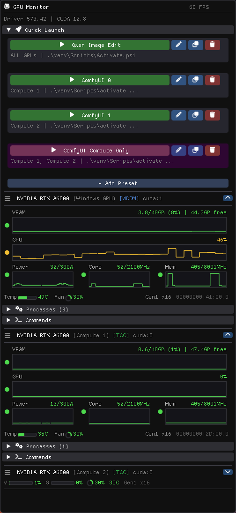
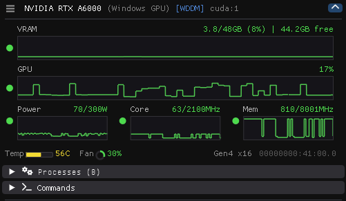

# GPU Monitor

A lightweight, cross-platform desktop application for real-time NVIDIA GPU monitoring.




## Features

### Real-time Metrics with Sparklines
- VRAM and GPU utilization with historical graphs
- Power draw, core clock, and memory clock
- Temperature and fan speed with color-coded health indicators
- PCIe generation and lane width
- ECC error counts (when supported)

**Time-Dilate**: Drag on any sparkline to adjust the time window from 5 seconds to 10 minutes. See your GPU history at any scale.



### Multi-GPU Support
- Monitor all NVIDIA GPUs simultaneously
- Drag-and-drop card reordering
- Custom nicknames for each GPU (Ctrl+click to rename)
- Collapse cards for a compact overview
- TCC/WDDM driver mode detection
- NVLink connection status

### 4-Level Health Indicators
Color-coded status for instant visibility:
- **Green**: Normal operation
- **Yellow**: Moderate load
- **Orange**: Heavy load
- **Red**: Approaching limits

### Process Management
- View all processes running on each GPU
- Memory usage per process
- Kill processes directly from the UI

### Quick Launch Presets
- Create presets with custom commands
- Select specific GPUs per preset
- Automatically sets `CUDA_VISIBLE_DEVICES`
- Open terminals with GPU environment pre-configured

### GPU Commands
- Copy Bus ID, CUDA index, or nvidia-smi commands
- Open terminal with specific GPUs selected
- Switch between TCC/WDDM modes (Windows, admin required)
- Set power limits
- Reset GPU

## Requirements

- **NVIDIA GPU** with driver 450.0 or later
- **CUDA Toolkit** (for NVML headers during build)
- **Windows**: Visual Studio 2022, Windows SDK
- **Linux**: GCC/Clang, GLFW3, OpenGL

## Configuration

Settings are automatically saved to:
- **Windows**: `%USERPROFILE%\.gpu_monitor\presets.json`
- **Linux**: `$HOME/.config/gpu_monitor/presets.json`

## Dependencies

- [Dear ImGui](https://github.com/ocornut/imgui) (bundled as submodule)
- [NVML](https://developer.nvidia.com/nvidia-management-library-nvml) (part of CUDA Toolkit)
- DirectX 11 (Windows) / GLFW + OpenGL (Linux)

## License

MIT License - see [LICENSE](LICENSE) for details.

---

## Building from Source

### Clone with Submodules

```bash
git clone --recursive https://github.com/yourusername/gpu_monitor.git
cd gpu_monitor
```

### Windows

```powershell
cmake -B build -G "Visual Studio 17 2022" -A x64
cmake --build build --config Release
.\build\Release\gpu_monitor.exe
```

### Linux

```bash
# Install dependencies (Debian/Ubuntu)
sudo apt install libglfw3-dev libgl1-mesa-dev

cmake -B build -DCMAKE_BUILD_TYPE=Release
cmake --build build
./build/gpu_monitor
```

### Custom CUDA Path

If CUDA is not auto-detected:

```bash
cmake -B build -DCUDAToolkit_ROOT=/path/to/cuda
```

## Architecture

```
src/
├── main_win32.cpp        # Windows: DirectX 11 + Win32
├── main_linux.cpp        # Linux: OpenGL 3 + GLFW
├── gpu_monitor.h/cpp     # NVML wrapper, background polling
├── ui.h/cpp              # Dear ImGui UI
└── platform/
    ├── platform.h        # Cross-platform interface
    ├── platform_win32.cpp
    └── platform_linux.cpp
```
